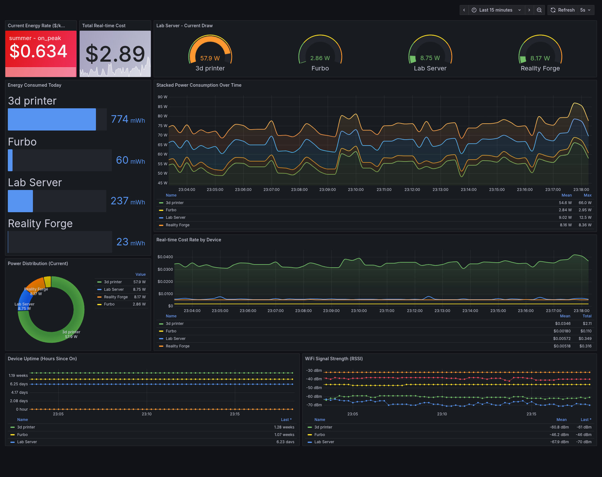

# Kasa Exporter

<!-- Version & Release -->
[](https://github.com/TheBranchDriftCatalyst/kasa-exporter/releases)
[](LICENSE)
[](https://www.python.org/)

<!-- Build & Quality -->
[](https://github.com/TheBranchDriftCatalyst/kasa-exporter)
[](https://github.com/TheBranchDriftCatalyst/kasa-exporter)
[](https://github.com/astral-sh/ruff)

<!-- GitHub Stats -->
[](https://github.com/TheBranchDriftCatalyst/kasa-exporter/stargazers)
[](https://github.com/TheBranchDriftCatalyst/kasa-exporter/network/members)
[](https://github.com/TheBranchDriftCatalyst/kasa-exporter/issues)
[](https://github.com/TheBranchDriftCatalyst/kasa-exporter/pulls)
[](https://github.com/TheBranchDriftCatalyst/kasa-exporter/commits)

<!-- Tech Stack -->
[](https://fastapi.tiangolo.com/)
[](https://prometheus.io/)
[](https://grafana.com/)
[](https://www.docker.com/)
[](https://python-poetry.org/)

<!-- Platform Support -->
[](https://github.com/TheBranchDriftCatalyst/kasa-exporter)
[](https://github.com/TheBranchDriftCatalyst/kasa-exporter)

<!-- Dependencies -->
[](https://github.com/python-kasa/python-kasa)
[](https://taskfile.dev/)

Prometheus exporter for TP-Link Kasa smart plugs with real-time power monitoring and time-of-use cost tracking.

## Features

- ⚡ **Real-time Power Monitoring**: Track current power consumption (watts) for all connected Kasa devices
- 💰 **Time-of-Use Cost Tracking**: Calculate energy costs with tiered pricing (off-peak, mid-peak, on-peak)
- 📊 **Prometheus Metrics**: Export 20+ device metrics in Prometheus format
- 📈 **Grafana Dashboards**: Pre-built dashboards with power analytics and cost tracking
- 🌐 **Web Dashboard**: Simple HTML dashboard with live device cards (auto-refresh every 10s)
- 🔍 **Auto-Discovery**: Automatic device discovery via Kasa cloud API
- 🏷️ **Rich Labels**: Device name, model, IP address, seasonal rates, and more
- 🔄 **Background Tasks**: Async device polling, metric collection, and registry management
- 📤 **Push Gateway Support**: Optional Prometheus push gateway integration

## Screenshots

### Power Analytics Dashboard



Comprehensive power monitoring with:
- Real-time consumption graphs
- Individual device gauges
- Energy cost tracking with TOU pricing
- WiFi signal strength
- Device uptime monitoring

> **Note:** Screenshots are automatically generated using `task screenshot`

## Quick Start

```bash
# Development mode (runs entire stack)
task dev
```

This starts:
- **Kasa Exporter** (http://localhost:9201) - FastAPI app with metric endpoints (dev port)
- **Prometheus** (http://localhost:9090) - Metrics database
- **Grafana** (http://localhost:3000) - Dashboards (default login: admin/turbopookipanda)
- **Grafana Image Renderer** (http://localhost:8081) - Screenshot service
- **Push Gateway** (http://localhost:9091) - Optional metrics push target

See [docs/DEPLOYMENT.md](docs/DEPLOYMENT.md) for detailed deployment instructions.

## Installation

### Production Installation (System Service)

Install kasa-exporter as a system service that runs automatically on boot:

```bash
# Linux (systemd) or macOS (launchd)
cd scripts/install
sudo ./install.sh
```

The installer will:
- Install the application to `/opt/kasa-exporter`
- Create a systemd/launchd service
- Prompt for Kasa credentials
- Start the service automatically

**Manage the service:**
```bash
task service:status      # Check status
task service:logs        # View logs
task service:restart     # Restart service
task service:health      # Health check
```

See [scripts/install/README.md](scripts/install/README.md) for advanced installation options.

### Development Installation

For development with hot-reload:

```bash
# Clone and install dependencies
poetry install --with dev

# Run development stack
task dev
```

## Requirements

### Credentials Required

**Kasa Cloud Credentials** are **REQUIRED** for device discovery:
- The exporter uses the `python-kasa` library's cloud-based discovery
- You must provide valid TP-Link Kasa account credentials
- Local-only operation is not currently supported

```bash
export KASA_USERNAME="your_email@example.com"
export KASA_PASSWORD="your_password"
```

### Supported Devices

**Currently Supported:**
- **KP125M** - Smart Plug with Energy Monitoring (fully tested)

**Potentially Compatible** (untested):
- KP115 - Energy Monitoring Plug
- HS110 - Energy Monitoring Plug
- Other Kasa energy monitoring devices

> **Note:** Only KP125M metrics are currently defined. Other devices may work but will export fewer metrics.

## Architecture

The exporter runs three background tasks in an async event loop:

```
┌─────────────┐
│ Kasa Cloud  │ ← Credentials (REQUIRED)
└──────┬──────┘
       │
       ▼
┌──────────────────────────┐
│   Smart Plugs Network    │
│  ┌────────┐  ┌─────────┐ │
│  │Lab Svr │  │ Mjolnir │ │ ...
│  │(KP125M)│  │ (KP125M)│ │
│  └────────┘  └─────────┘ │
└──────────┬───────────────┘
           │
           │ python-kasa discover() every 10s
           ▼
    ┌──────────────────────────┐
    │   Kasa Exporter (FastAPI)│
    │   Background Tasks:       │
    │   • Device Discovery      │
    │   • Metric Collection     │
    │   • Push Gateway (opt)    │
    │   • Registry Cleanup      │
    └──────┬───────────────────┘
           │
           ├─ GET / (HTML Dashboard)
           ├─ GET /metrics (Prometheus)
           └─ GET /debug (JSON API)
           │
           ▼
    ┌──────────────┐
    │  Prometheus  │ ← Scrapes /metrics every 10s
    └──────┬───────┘
           │
           ▼
    ┌──────────────┐
    │   Grafana    │ + Image Renderer
    └──────────────┘
         │
         └─ Power Analytics Dashboard
```

### Background Task Loop (10 second intervals)

1. **Device Discovery & Metric Collection** (`device_exporter.scrape_devices()`)
   - Discover devices via Kasa cloud API
   - Update each device's state
   - Calculate all 20+ metrics including TOU cost
   - Update Prometheus registry

2. **Push Gateway** (`push_gateway.push_to_gateway()`) - Optional
   - Push metrics to Prometheus Push Gateway
   - Disabled by default (`PUSH_GATEWAY_DISABLED=true`)

3. **Device Registry Cleanup** (`device_registry.update_registry()`)
   - Remove devices not seen in > 1 minute
   - Prevents stale metrics

## Metrics

The exporter provides **20+ metrics per device** using a sophisticated metric extraction framework:

### Power & Energy Metrics
| Metric | Type | Description | Labels |
|--------|------|-------------|--------|
| `current_consumption` | Gauge | Current power draw (watts) | device_id, alias, model |
| `consumption_today` | Gauge | Energy consumed today (Wh) | device_id, alias, model |
| `consumption_this_month` | Histogram | Monthly consumption distribution | device_id, alias, model |
| `consumption_cost` | Gauge | **Real-time cost rate ($/hour)** | device_id, alias, model |
| `current_energy_rate` | Gauge | Current TOU rate ($/kWh) | device_id, alias, model, season, rate_class |

### Device Status
| Metric | Type | Description | Labels |
|--------|------|-------------|--------|
| `state` | Enum | Device on/off state | device_id, alias, model |
| `on_since` | Gauge | Hours since device turned on | device_id, alias, model |
| `rssi` | Gauge | WiFi signal strength (dBm) | device_id, alias, model |
| `signal_level` | Gauge | WiFi signal quality (0-100) | device_id, alias, model |
| `cloud_connection` | Enum | Cloud connectivity status | device_id, alias, model |
| `led` | Enum | LED indicator state | device_id, alias, model |

### Device Information
| Metric | Type | Description | Labels |
|--------|------|-------------|--------|
| `ssid` | Info | Connected WiFi network SSID | device_id, alias, model |
| `current_firmware_version` | Info | Installed firmware version | device_id, alias, model |
| `available_firmware_version` | Info | Available firmware update | device_id, alias, model |
| `update_available` | Enum | Firmware update availability | device_id, alias, model |
| `auto_update_enabled` | Enum | Auto-update configuration | device_id, alias, model |

### Auto-off Timer
| Metric | Type | Description | Labels |
|--------|------|-------------|--------|
| `auto_off_enabled` | Enum | Auto-off timer state | device_id, alias, model |
| `auto_off_minutes` | Gauge | Minutes until auto-off | device_id, alias, model |
| `auto_off_at` | Info | Timestamp of scheduled auto-off | device_id, alias, model |

### Registry Metrics
| Metric | Type | Description |
|--------|------|-------------|
| `device_registry_total_devices` | Gauge | Currently registered devices |
| `device_registry_discovered_devices_total` | Counter | Total devices discovered |
| `device_registry_pruned_devices_total` | Counter | Total devices pruned (>1min inactive) |

### Update Tracking
| Metric | Type | Description | Labels |
|--------|------|-------------|--------|
| `update_attempts` | Counter | Firmware update attempts | device_id, alias, model |

## Time-of-Use Cost Calculation

The exporter implements **real-time energy cost tracking** with seasonal time-of-use (TOU) pricing.

### How It Works

**Cost Rate Calculation:**
```python
cost_rate ($/hour) = (current_consumption_watts / 1000) × rate_per_kwh
```

**Example:**
- Device drawing **50W** during on-peak ($0.634/kWh)
- Cost rate = (50 / 1000) × 0.634 = **$0.0317/hour**
- Running 24 hours = **$0.761/day**

### Rate Schedules

**Timezone:** Configurable via `TZ` environment variable (default: `America/Los_Angeles`)

**Rate Schedule:** SDG&E TOU-ELEC (October 2025 rates)

#### Summer (June 1 - October 31)
| Period | Time | Rate |
|--------|------|------|
| **Super Off-Peak** | 12am-6am | **$0.314/kWh** |
| **Off-Peak** | 6am-4pm, 9pm-12am | **$0.351/kWh** |
| **On-Peak** | 4pm-9pm | **$0.634/kWh** |

#### Winter (November 1 - May 31)
| Period | Time | Rate |
|--------|------|------|
| **Super Off-Peak** | 12am-6am | **$0.314/kWh** |
| **Off-Peak** | 6am-4pm, 9pm-12am | **$0.351/kWh** |
| **On-Peak** | 4pm-9pm | **$0.634/kWh** |

> **Note:** SDG&E TOU-ELEC uses the same time-of-day schedule year-round. These rates are for SDG&E bundled service (generation + delivery) and do not include the $16 monthly Base Services Charge.

### Metrics & Labels

The cost calculation generates two key metrics:

1. **`consumption_cost`** - Instantaneous cost rate in $/hour
   - Labels: `device_id`, `alias`, `model`

2. **`current_energy_rate`** - Current TOU rate in $/kWh
   - Labels: `device_id`, `alias`, `model`, **`season`**, **`rate_class`**
   - `season`: "summer" or "winter"
   - `rate_class`: "super_off_peak", "off_peak", or "on_peak"

### Example Prometheus Queries

```promql
# Total cost rate across all devices
sum(consumption_cost)

# Cost by device
sum(consumption_cost) by (alias)

# Cost during peak hours only
sum(consumption_cost{rate_class="on_peak"})

# Cost during super off-peak hours (midnight-6am)
sum(consumption_cost{rate_class="super_off_peak"})

# Compare peak vs super off-peak costs
sum(consumption_cost{rate_class="on_peak"}) / sum(consumption_cost{rate_class="super_off_peak"})

# Current rate by season
current_energy_rate{season="summer"}
```

### Configuration

To customize rates, edit: `kasa_exporter/utils/time_of_use_calc.py`

```python
TIME_OF_USE_CONFIG = {
    "season": {
        "summer": ["06-01", "10-31"],  # SDG&E Summer: June 1 - October 31
        "winter": ["11-01", "05-31"],  # SDG&E Winter: November 1 - May 31
    },
    "summer": {
        "rate": {
            "super_off_peak": 0.314,  # $0.314/kWh - midnight to 6am
            "off_peak": 0.351,        # $0.351/kWh - 6am-4pm, 9pm-12am
            "on_peak": 0.634,         # $0.634/kWh - 4pm to 9pm
        },
        "super_off_peak": [("00:00", "06:00")],
        "off_peak": [("06:00", "16:00"), ("21:00", "23:59")],
        "on_peak": [("16:00", "21:00")],
    },
    # ...
}
```

See [docs/COST_CALCULATION_AUDIT.md](docs/audits/COST_CALCULATION_AUDIT.md) for implementation details.

## Grafana Dashboards

### Power Analytics Dashboard

**Access:** http://localhost:3000/d/kasa-power-analytics

Pre-built dashboard featuring:
- **Real-time Power Consumption** - Live timeline of watts consumed
- **Device Gauges** - Individual device current draw with color thresholds
- **Energy Today** - Bar chart of daily consumption by device
- **Power Distribution** - Pie chart showing proportional usage
- **Stacked Consumption** - Area chart of power over time
- **Cost Analytics** - Real-time cost rate with TOU pricing breakdown
- **WiFi Signal** - RSSI monitoring per device
- **Device Uptime** - Hours online tracking

### Screenshot Automation

Auto-generate dashboard screenshots for documentation:

```bash
# Screenshot all dashboards
task screenshot

# Or directly
poetry run python scripts/screenshot_dashboard.py
```

**Features:**
- Auto-discovers dashboards from `etc/grafana/dashboards/*.json`
- Extracts UID and title from JSON metadata
- Uses Grafana Image Renderer for pixel-perfect canvas/SVG capture
- Kiosk mode (no sidebar/chrome)
- Auto-crops excess background (smart dark theme detection)
- Saves to `docs/screenshots/` with timestamps

**How it works:**
1. Scans `etc/grafana/dashboards/` for `.json` files
2. Parses each dashboard's `uid` and `title`
3. Calls Grafana's `/render/` API endpoint
4. Captures full scrollable page (1920x4000px viewport)
5. Auto-crops dark background using Pillow
6. Saves as `{filename}-{timestamp}.png`

The screenshot tool uses Grafana's official image renderer service to properly capture all chart elements including canvas and SVG graphics that browser automation tools like Playwright cannot capture.

## Environment Variables

### Required

```bash
# Kasa Cloud Credentials (REQUIRED for device discovery)
KASA_USERNAME=your_email@example.com
KASA_PASSWORD=your_password
```

### Optional

```bash
# Exporter Configuration
METRICS_PORT=9200                    # Default: 9200 (production), 9201 (development)

# Time-of-Use Cost Calculation
TZ=America/Los_Angeles               # Timezone for TOU calculations (default: America/Los_Angeles)
                                     # Use IANA timezone names (e.g., America/New_York, America/Chicago)

# Push Gateway (disabled by default)
PUSH_GATEWAY_HOST=localhost          # Default: localhost
PUSH_GATEWAY_PORT=9091               # Default: 9091
PUSH_GATEWAY_DISABLED=true           # Default: true (disabled)

# Grafana (for docker-compose)
GRAFANA_ADMIN_PASSWORD=admin         # Default: admin

# Network Interface (Linux/Docker only)
MDNS_INTERFACE=eth0                  # Network interface for broadcasts
```

See `.env.example` for complete configuration template.

## Development

### Setup

```bash
# Install dependencies
poetry install

# Install dev dependencies (includes Playwright for screenshots)
poetry install --with dev
```

### Running

```bash
# Full stack (exporter + prometheus + grafana + renderer)
task dev

# Exporter only
poetry run python -m kasa_exporter

# With uvicorn directly (auto-reload on dev port)
poetry run uvicorn kasa_exporter.__main__:app --reload --host 0.0.0.0 --port 9201
```

### Utilities

```bash
# View Prometheus database statistics
./scripts/prom_stats.sh

# Or install directly from GitHub
curl -fsSL https://raw.githubusercontent.com/TheBranchDriftCatalyst/kasa-exporter/main/scripts/prom_stats.sh | bash

# Generate dashboard screenshots
task screenshot

# Run tests
poetry run pytest

# Stop all services
task dev:stop
```

### FastAPI Endpoints

- **GET /** - HTML dashboard with device cards (auto-refresh 10s)
- **GET /metrics** - Prometheus metrics (plaintext format)
- **GET /debug** - JSON API returning raw device info

### Application Lifecycle

Uses modern FastAPI `lifespan` pattern for clean async startup/shutdown:

```python
@asynccontextmanager
async def lifespan(app: FastAPI):
    # Startup: Create 3 background tasks
    tasks = [
        asyncio.create_task(device_exporter.scrape_devices()),
        asyncio.create_task(push_gateway.push_to_gateway()),
        asyncio.create_task(device_registry.update_registry()),
    ]
    yield
    # Shutdown: Cancel all tasks gracefully
    for task in tasks:
        task.cancel()
```

## Platform Support

- **macOS**: Runs natively (Docker Desktop can't do UDP broadcasts)
- **Linux**: Runs in Docker with `network_mode: host`

**Why host networking?**
- Allows UDP broadcasts for mDNS device discovery
- Simplifies service-to-service communication via localhost

See [docs/DEPLOYMENT.md](docs/DEPLOYMENT.md) for platform-specific setup.

## Tech Stack

- **Language:** Python 3.12+
- **Framework:** FastAPI (async/await)
- **Metrics:** prometheus-client
- **Device Library:** python-kasa
- **Monitoring:** Prometheus + Grafana
- **Automation:** Task (go-task)
- **Dependency Management:** Poetry
- **Screenshot Tool:** Grafana Image Renderer + Pillow
- **Logging:** structlog (JSON structured logging)
- **Time Handling:** pytz (timezone-aware calculations)

## Known Limitations

1. **Kasa Cloud Dependency** - Requires cloud credentials; local-only mode not supported
2. **Device Pruning** - Devices removed after 60 seconds of inactivity (may cause metric gaps)
3. **KP125M Only** - Only KP125M metrics fully defined; other devices untested
4. **No Health Checks** - No `/health` or `/ready` endpoints for Kubernetes
5. **Minimal Tests** - Test coverage limited to TOU calculations and metric extraction framework

## Links

- [Code Audit](docs/audits/2025-10-27-code-review.md) - Comprehensive security & code review
- [Cost Calculation Audit](docs/audits/COST_CALCULATION_AUDIT.md) - TOU implementation details
- [Deployment Guide](docs/DEPLOYMENT.md) - Platform-specific deployment instructions
- [Python-Kasa Library](https://github.com/python-kasa/python-kasa) - Device communication library
- [Prometheus](https://prometheus.io/) - Metrics database
- [Grafana](https://grafana.com/) - Dashboard platform

## License

MIT
