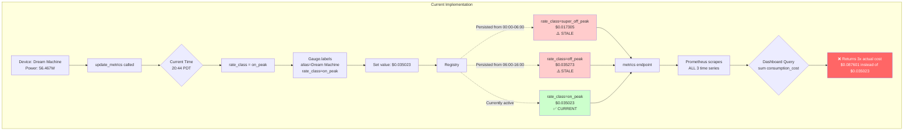
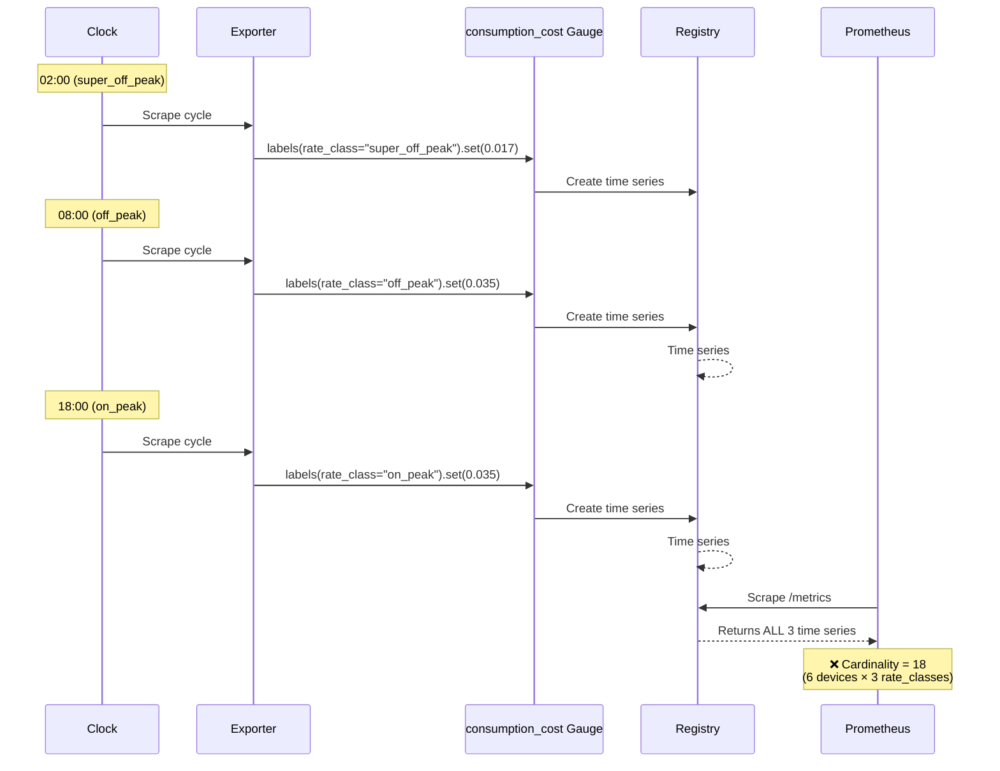
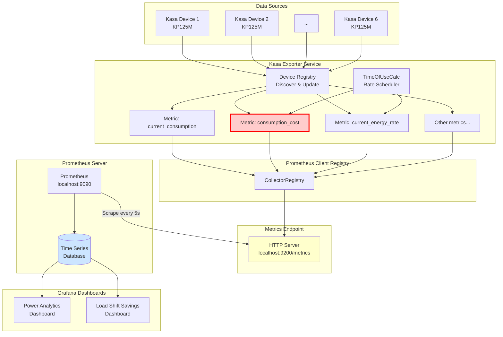

# Metric Structure Redesign

**Status**: ✅ PHASE 1 COMPLETED - Option 1 Implemented
**Date**: 2025-11-01 to 2025-11-02

**Related Documents** (archived):
- `docs/archive/phase1-metrics-troubleshooting/BUG.md` - Original bug report
- `docs/archive/phase1-metrics-troubleshooting/FIX_APPLIED.md` - Implementation details
- `docs/archive/phase1-metrics-troubleshooting/README.md` - Phase 1 summary

---

## ✅ Completed: Phase 1 Implementation

**Solution Applied**: Option 1 (Remove rate_class Label)

**What was done**:
- Removed `rate_class` label from `consumption_cost` metric (`kasa_exporter/devices/KP125M.py:134-143`)
- Reduced cardinality from 18 to 6 time series
- Fixed dashboard cost calculations (was returning 3× actual values)
- Rate class information now available via `current_energy_rate` metric

**Results**:
- ✅ Cardinality explosion eliminated
- ✅ Stale label persistence resolved
- ✅ Dashboard queries returning correct values
- ✅ Clean, maintainable design following Prometheus best practices

---

## Current Architecture (BROKEN)

### Problem Visualization



### Data Flow



---

## Solution Option 1: Remove rate_class Label (RECOMMENDED)

### Architecture

```mermaid
graph TB
    subgraph "Option 1: Single Metric Without rate_class Label"
        A[Device: Dream Machine<br/>Power: 56.467W] --> B[update_metrics called]
        B --> C{Current Time<br/>20:44 PDT}
        C --> D[Current rate: $0.634/kWh]

        D --> E[Gauge.labels<br/>alias=Dream Machine<br/>NO rate_class label]
        E --> F[Set value: $0.035023]

        F --> G[Registry]
        G --> H[Single time series<br/>consumption_cost✅]

        H --> I[/metrics endpoint]
        I --> J[Prometheus scrapes<br/>1 time series per device]

        J --> K{Dashboard Query<br/>sum consumption_cost}
        K --> L[✅ Returns actual cost<br/>$0.035023]

        subgraph "Separate Rate Info Metric"
            M[current_energy_rate Gauge]
            M --> N[labels<br/>rate_class=on_peak<br/>season=summer]
            N --> O[Set value: $0.634]
            O --> G
        end

        D --> M
    end

    style H fill:#ccffcc
    style L fill:#66ff66,color:#000
```

### Pros & Cons

**Advantages**:
- ✅ Fixes cardinality explosion (6 metrics instead of 18)
- ✅ No stale metrics
- ✅ Simple, clean design
- ✅ Rate class information still available via `current_energy_rate` metric
- ✅ Can join metrics in PromQL for analysis

**Disadvantages**:
- ⚠️ Requires PromQL join to get cost by rate_class
- ⚠️ Loses historical cost-by-period breakdown

**Implementation**:
```python
# KP125M.py
"consumption_cost": {
    "type": PromMetricType.GAUGE,
    "getter": lambda device: calculator.calc_rate(
        device.state_information["Current consumption"]
    ),
    # REMOVED: derive_labels with rate_class
},
"current_energy_rate": {
    "type": PromMetricType.GAUGE,
    "getter": lambda _d: calculator.get_rate_for_time(
        datetime.now(pytz.timezone("America/Denver")),
        calculator.get_current_season()
    ),
    "derive_labels": {
        "season": lambda _d: calculator.get_current_season(),
        "rate_class": lambda _d: calculator.get_rate_name(...)
    },
},
```

**Dashboard Query Example**:
```promql
# Get current cost
sum(consumption_cost)

# Get cost with rate_class info (join)
sum by (rate_class) (
  consumption_cost
  * on(alias) group_left(rate_class)
  current_energy_rate
)
```

---

## Solution Option 2: Separate Metrics for Each Rate Class

### Architecture

```mermaid
graph TB
    subgraph "Option 2: Explicit Metrics Per Rate Tier"
        A[Device: Dream Machine<br/>Power: 56.467W] --> B[update_metrics called]

        B --> C1[consumption_cost_current]
        B --> C2[consumption_cost_if_super_off_peak]
        B --> C3[consumption_cost_if_off_peak]
        B --> C4[consumption_cost_if_on_peak]

        C1 --> D1[Current actual: $0.035023<br/>✅ Real-time cost]
        C2 --> D2[Theoretical: $0.017305<br/>📊 What-if analysis]
        C3 --> D3[Theoretical: $0.019834<br/>📊 What-if analysis]
        C4 --> D4[Theoretical: $0.035023<br/>📊 What-if analysis]

        D1 & D2 & D3 & D4 --> E[Registry]
        E --> F[/metrics endpoint<br/>4 metrics per device]
        F --> G[Prometheus scrapes]

        G --> H{Dashboard}
        H --> I1[sum consumption_cost_current<br/>✅ Actual cost]
        H --> I2[sum consumption_cost_if_super_off_peak<br/>📊 Savings potential]
    end

    style D1 fill:#ccffcc
    style D2 fill:#cce5ff
    style D3 fill:#cce5ff
    style D4 fill:#cce5ff
    style I1 fill:#66ff66,color:#000
    style I2 fill:#6699ff,color:#fff
```

### Pros & Cons

**Advantages**:
- ✅ Clear, explicit naming
- ✅ Enables "what-if" cost analysis without complex queries
- ✅ No label cardinality issues
- ✅ Perfect for load-shift savings dashboard

**Disadvantages**:
- ⚠️ Higher metric count (24 instead of 6)
- ⚠️ Redundant calculations (same power × different rates)
- ⚠️ More metrics to maintain

**Implementation**:
```python
# KP125M.py
"consumption_cost_current": {
    "type": PromMetricType.GAUGE,
    "getter": lambda device: calculator.calc_rate(
        device.state_information["Current consumption"]
    ),
    "derive_labels": {
        "rate_class": lambda _d: calculator.get_rate_name(...)
    },
},
"consumption_cost_if_super_off_peak": {
    "type": PromMetricType.GAUGE,
    "getter": lambda device: (
        device.state_information["Current consumption"] / 1000 * 0.314
    ),
},
"consumption_cost_if_off_peak": {
    "type": PromMetricType.GAUGE,
    "getter": lambda device: (
        device.state_information["Current consumption"] / 1000 * 0.351
    ),
},
"consumption_cost_if_on_peak": {
    "type": PromMetricType.GAUGE,
    "getter": lambda device: (
        device.state_information["Current consumption"] / 1000 * 0.634
    ),
},
```

**Dashboard Query Example**:
```promql
# Current actual cost
sum(consumption_cost_current)

# Savings if shifted to super_off_peak
sum(consumption_cost_current) - sum(consumption_cost_if_super_off_peak)

# Percentage savings
((sum(consumption_cost_current) - sum(consumption_cost_if_super_off_peak)) / sum(consumption_cost_current)) * 100
```

---

## Solution Option 3: Clear Stale Labels (COMPLEX)

### Architecture

```mermaid
graph TB
    subgraph "Option 3: Active Label Management"
        A[Device: Dream Machine] --> B[update_metrics called]
        B --> C{Current Time<br/>18:00 on_peak}

        C --> D[Check previous rate_class]
        D --> E{Rate changed?}

        E -->|Yes| F[Clear stale labels<br/>remove super_off_peak<br/>remove off_peak]
        E -->|No| G[Skip cleanup]

        F --> H[Set new label<br/>rate_class=on_peak]
        G --> H

        H --> I[Registry<br/>Only 1 time series per device]

        I --> J[/metrics endpoint]
        J --> K[Prometheus scrapes]
        K --> L[✅ Correct cardinality]
    end

    style I fill:#ccffcc
    style L fill:#66ff66,color:#000
```

### Pros & Cons

**Advantages**:
- ✅ Keeps rate_class label
- ✅ Maintains low cardinality
- ✅ Preserves historical data structure

**Disadvantages**:
- ❌ Complex to implement correctly
- ❌ Requires state tracking (previous rate_class)
- ❌ Race conditions if multiple threads
- ❌ Risk of accidentally clearing active metrics

**Implementation**:
```python
# Would need to add cleanup logic in prom_device_extractor.py
def update_metrics(self, device: Any) -> None:
    for metric_key, metric_info in self.metric_objects.items():
        if metric_key == "consumption_cost":
            # Get current rate_class
            current_rate_class = calculator.get_rate_name(...)

            # Remove all other rate_class labels
            for old_rate_class in ["super_off_peak", "off_peak", "on_peak"]:
                if old_rate_class != current_rate_class:
                    try:
                        labels = {**device_labels, "rate_class": old_rate_class}
                        metric_object.remove(*labels.values())
                    except KeyError:
                        pass  # Label combo doesn't exist

        # Continue with normal update...
```

---

## Comparison Matrix

| Aspect | Option 1:<br/>Remove Label | Option 2:<br/>Separate Metrics | Option 3:<br/>Clear Stale |
|--------|---------------------------|-------------------------------|---------------------------|
| **Metric Count** | 6 (best) | 24 | 6 |
| **Complexity** | Low ✅ | Low ✅ | High ❌ |
| **What-If Analysis** | Requires PromQL join | Native support ✅ | Requires separate queries |
| **Cardinality Risk** | None ✅ | None ✅ | Low (if implemented correctly) |
| **Maintenance** | Easy ✅ | Easy ✅ | Difficult ❌ |
| **Historical Data** | Preserved | Preserved | Preserved |
| **Dashboard Updates** | Moderate | Minimal | Minimal |

---

## Recommended Approach

**Primary Recommendation**: **Option 1** (Remove rate_class Label)

**Rationale**:
1. Simplest to implement and maintain
2. Eliminates cardinality issue completely
3. Follows Prometheus best practices (low cardinality)
4. Rate class information still available via `current_energy_rate` metric
5. PromQL joins are well-supported and performant

**Migration Path**:
1. Update `KP125M.py` to remove `derive_labels` from `consumption_cost`
2. Update dashboard queries to use joins where needed
3. Restart exporter
4. Wait for old metrics to expire in Prometheus (or reset Prometheus data)

**Alternative**: If "what-if" analysis is critical, use **Option 2** for explicit theoretical cost metrics.

---

## Implementation Plan

See: `docs/METRICS_FIX_IMPLEMENTATION.md`

---

## Mermaid Diagram: Full System View



**Legend**:
- 🔴 Red = Current problem area (consumption_cost with rate_class label)
- 🟡 Yellow = Metrics endpoint
- 🔵 Blue = Data storage
- 🟢 Green = Fixed metrics (after applying solution)
